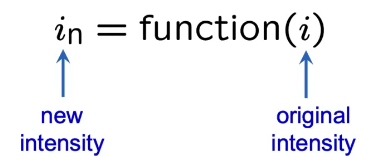
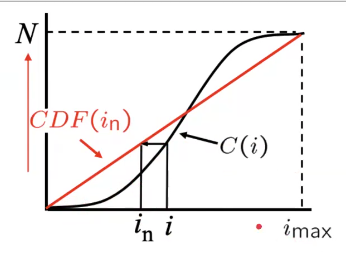
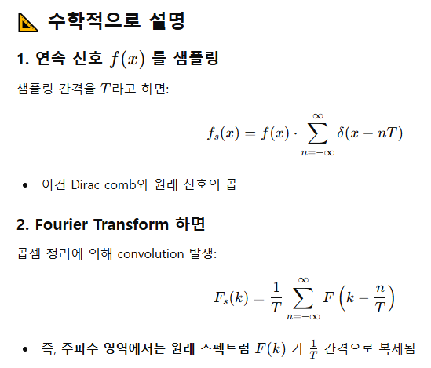
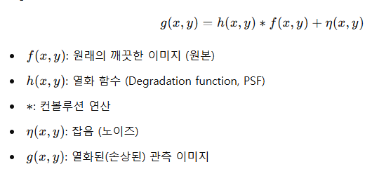
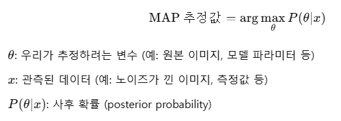

# Image Enhancement
디지털 이미지 처리에서 이미지를 사람이 더 잘 인식하거나, 기계가 더 정확히 분석할 수 있도록 개선하는 기술을 말해.
즉, 원본 이미지를 그대로 쓰기에는 품질이 낮거나 정보가 부족할 때, 노이즈 제거, 밝기 조절, 선명도 증가, 대비 향상 등을 통해 이미지의 품질을 높이는 과정

## 이미지 디지털화
원본 아날로그 이미지를 Spatial Sampling으로 픽셀 단위로 쪼개고, Intensity Quantization으로 픽셀을 숫자 값으로 표현

### Intensity Quantization
이미지의 픽셀 강도를 이산 수준으로 나누는 과정(아날로그 -> 디지털)
- 예시
  - 8bit: 256단계 양자화
  - 4bit: 16단계 양자화
- 역할
  - 데이터 압축(양자화 수준 낮을수록 용량 작음)
  - 처리속도 향상

### Spatial Sampling(공간 샘플링)
이미지의 공간적 해상도를 설정하기 위해, 얼마나 자주 이미지르 샘플링할지 결정
- 예시
  - 고해상도: 더 촘촘히 샘플링 -> 많은 픽셀 -> 정밀
  - 저해상도: 덜 촘촘히 샘플링 -> 적은 픽셀 -> 품질 저하

### Point Operation
이미지의 각 픽셀에 대해 독립적으로 어떤 수학적 변환을 적용하는 처리 방식.
Image Histogram을 통해 이미지의 밝기 분포를 확인한다.

파라미터 값인 r이 커지면 어둡게하고 작아지면 밝게한다.
- 주요 예시
  - Contrast Stretching(대비조절): 밝기 구간별로 대비를 높여 선명하게

## 주요 기법

### Sharpening
경계 강조, 흐릿한 이미지 선명하게

### Denoising
노이즈 제거

#### Denoising With Sparse Prior
이미지는 어떤 **희소한 표현(sparse representation)**을 갖는다고 가정하고,  이 특성을 이용해서 노이즈를 제거하는 방법

### Filtering
블러 처리, 엣지 강조 등 다양한 목적의 필터 사용

- Temporal Filtering(시간적 필터링)
  - 시간적으로 연속된 영상 프레임들 간의 변화나 잡음을 줄이기 위해 시간 축을 따라 신호를 필터링
  - Averaging(프레임 평균), Difference(변화) 등 다양한 방식
- Image Filtering: 필터(커널)를 적용해서 이미지 성질을 바꾸는 연산(보통 픽셀 주변 이웃 정보까지 고려)
  - 필터를 이미지에 슬라이딩
  - 필터와 픽셀 블록의 곱을 계산
  - 결과값으로 새로운 픽셀 생성

### Deblurring
흐릿하게 찍힌 이미지를 선명하게 복원하는 기법

- 주요 원인
  - 카메라 흔들림
  - 초점 오류
  - 저조도 환경에서 긴 노출 시간
- 주요 기법
  - Wiener Filter: 노이즈가 포함된 열화된 이미지를 최적으로 복원하는 필터. 이미지가 흐려졌거나 노이즈가 섞였을 때, 가능한 원래 이미지에 가깝도록 복원해주는 통계 기반 필터이다.
    - Inverse Filtering처럼 단순히 나누는 게 아니라, 노이즈의 영향까지 고려해서 안정적으로 복원
    - 주파수별로 신뢰도가 높은 성분은 살리고, 노이즈가 심한 성분은 억제하는 스마트한 필터
  - Blind Deconvolution: 흐릿한 사진을 보고 "초점이 나갔는지", "움직였는지" 아무 정보가 없는 상태에서 원래 이미지를 되돌리는 작업!
  - Deep Learning 기반: CNN, GAN 등을 활용해 흐릿한 이미지를 선명하게 재구성

### Contrast Enhancement
밝고 어두운 부분 간의 차이를 강조해서 이미지의 시각적 품질과 디테일을 높이는 기법

- 주요 기법
  - Histogram Equalization: 밝기 분포를 균일하게 만들어 대비 향상
    - 히스토그램 생성
    - 누적 분포함수(CDF) 계산
    - CDF를 이용해 각 픽셀 값을 새로운 값으로 매핑한다.
    - 
  - Gamma Correction: 밝기 보정 곡선을 적용해서 어두운 영역 강조

## Fourier Series(푸리에 급수)
복잡한 주기 함수를 단순한 사인(sin)과 코사인(cos)의 조합으로 표현하는 수학적 도구. 특히 신호 처리, 이미지 처리, 음성 분석, 진동 분석, 통신 이론 등 공학 전반에 걸쳐 핵심적인 개념이다.

## Fourier Transform(푸리에 변환)
어떤 신호나 함수를 주파수 성분으로 분해하는 수학적 도구. 이걸 통해 시간이나 공간 영역에 있는 복잡한 신호를 주파수 영역으로 바꿔서 그 속에 어떤 주파수 성분이 얼마나 포함되어 있는지를 알 수 있다.

## 1D Sampling Theorem (샘플링 정리)
spatial domain과 frequency domain의 연관성은 신호를 샘플링할 때 정보 손실 없이 복원 가능한 조건과 관련된다.

### Spatial Domain (공간 도메인)
- 시간에 따른 신호라면 time domain, 위치에 따른 신호면 spatial domain이라 부름.
- 예: f(x)는 연속적인 공간에서 정의된 신호 (예: 1차원 이미지 스캔)

### Frequency Domain (주파수 도메인)
- Fourier Transform을 통해 얻는 주파수 구성 정보
- 예: F(k)는 f(x)의 각 주파수 k에 대한 스펙트럼 성분

### 연관성
샘플링 정리(Sampling Theorem)는 공간 도메인에서의 "샘플 간격"이 주파수 도메인에서 "대역폭 제한"을 만들어낸다는 사실에 기반함.
- 핵심 : 공간 도메인에서 신호를 이산 샘플로 나누면, 주파수 도메인에서는 주기적인 복제(aliasing-발생되는 문제임)가 발생한다.
- 주파수 도메인으로 넘어오면서 Convolution연산이 곱하기 연산으로 바뀌어 더 효과적이다.

- 샘플링 간격이 작을수록 → 주파수 복제 간격이 넓어져 aliasing 방지 가능
- 샘플링은 공간 도메인에서의 이산화 작업이며, 이로 인해 **주파수 도메인에서 스펙트럼 복제(Periodic Spectrum)**가 생김
- 따라서, 공간 도메인에서의 샘플링 간격과 주파수 도메인의 복제 간격은 서로 역수 관계(inverse fourier 하면 역으로 복원)

### Aliasing이란
신호를 불충분하게 샘플링해서, 서로 다른 고주파 성분이 낮은 주파수처럼 보이는 왜곡 현상을 말함. 즉,
고주파 성분이 잘못 해석되어 다른 주파수처럼 "겹쳐서" 나타나는 현상.
→ 이로 인해 원래 신호를 정확히 복원할 수 없게 됨.

- 방지법
  - 샘플링 주파수 늘리기
  - Anti-aliasing Filter 적용(샘플링 전 고주파 성분 제거)

## Image restoration
이미지 복원은 이미지의 품질을 향상시키는 작업으로, 이미지의 손상을 복구하거나 노이즈를 제거하는 등의 작업을 포함한다.

### Degradation Model
원래 깨끗한 이미지가 어떻게 손상되었는지를 수학적으로 표현한 모델

f(x,y)(원래 이미지)를 g(x,y)에서 찾아내는 것이고 이를 위해 h(x,y)와 n(x,y)를 알아야함

#### 구성 요소
1. h(x,y): Point Spread Function(PSF): 어떤 픽셀이 퍼지는 방식(흐림, 모션 블러-움직이면서 찍힘, 초첨 흐림)
2. n(x,y): Noise: 이미지에 더해진 잡음

### MAP (Maximum A Posteriori) Estimation
관측된 데이터가 주어졌을 때, 어떤 **숨겨진 변수(모수)**가 가장 그럴듯한 값인지를 추정하는 방법.

### Low Rank Prior
Low-rank Prior는 어떤 데이터(예: 이미지, 행렬, 영상 등)가 랭크(rank)가 낮은 구조를 갖고 있다는 **사전 지식(prior)**을 바탕으로 문제를 푸는 방식.

- 복원과정
  - 흐릿하거나 손상된 이미지에서 유사한 패치들을 찾아 행렬로 구성
  - 그 행렬의 저랭크 구조를 유지하면서 노이즈 제거

### Non-local Regularization
이미지 내의 멀리 떨어진 위치들 사이에도 유사한 패턴이나 구조가 존재한다는 것을 이용해서,
복원 과정에서 이 유사성을 정규화(regularization) 조건으로 추가하는 기법

### Learning-based Denoising
노이즈가 낀 이미지와 깨끗한 이미지 쌍을 학습 데이터로 사용해서,  노이즈 제거 기능을 수행하는 **모델(예: 딥러닝 네트워크)**을 학습시키는 기법

- 다양한 기법
  - CNN 기반 Denoising: 가장 기본적이고 유명한 구조
    - DnCNN: 잔차 학습 방식(노이즈만 예측) 사용, 다양한 Gaussian 노이즈에 강함