# Deep Learning for Images
## Filter
### Vertical & Horizontal Edge detection
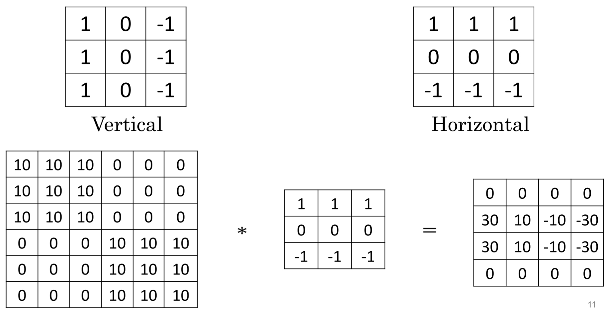

### Sobel & Scharr filter
edge를 검출하는 부분을 찾기 위해 미분을 이용해 찾는다. 수평방향 수직방향 둘다 가능하며 아래는 수평방향(x)이다.
scharr는 정확도와 회전 불변성을 높인 버전이다.
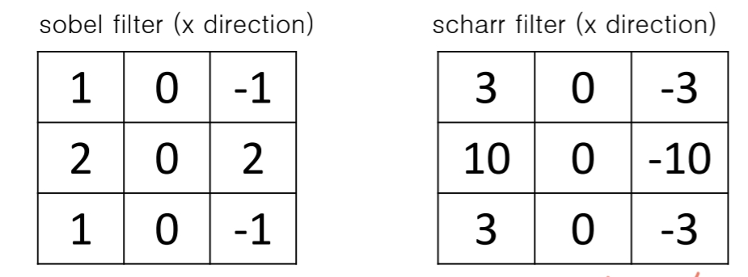

### Formula of Convolutions
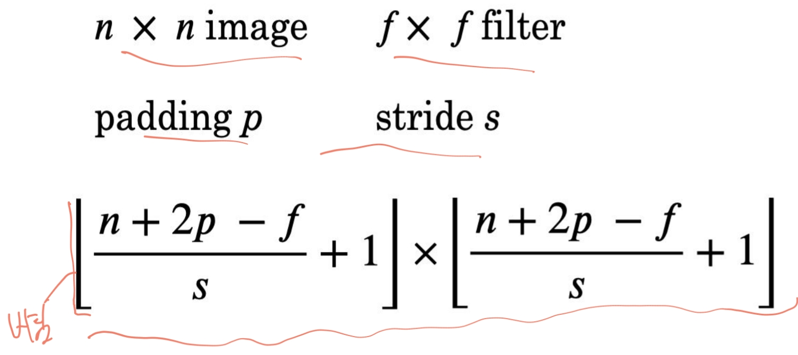

#### Padding
일반적으로 필터 적용 시 output size가 줄어드는데 줄어드는게 싫다면 **padding** 을 추가해준다.

#### Stride
합성곱 연산에서 필터(커널)가 겹치지 않고 일정 간격을 두고 이동하면서 데이터를 처리하는 방식입니다.
파라미터 수 만큼 여러 칸을 한 번에 건너뛰며 이동하므로 계산 위치가 줄어듭니다.

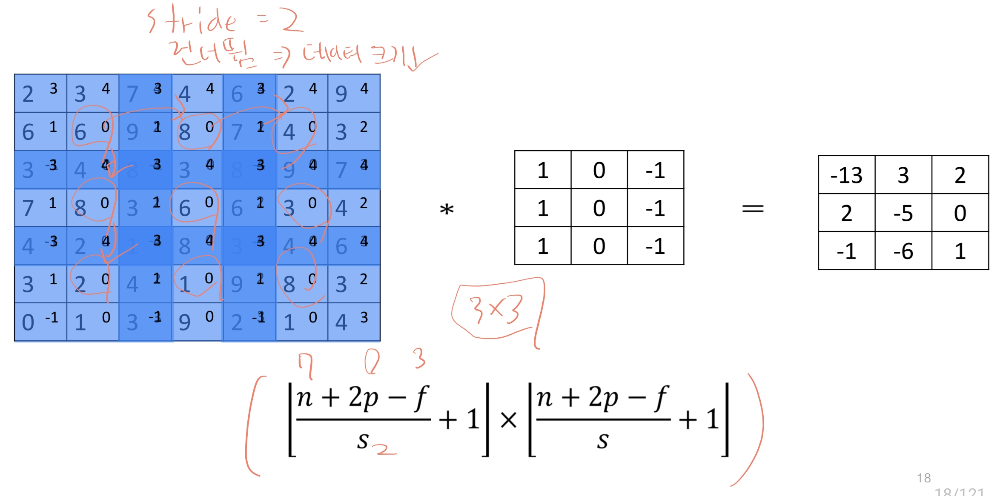

예시(RGB)
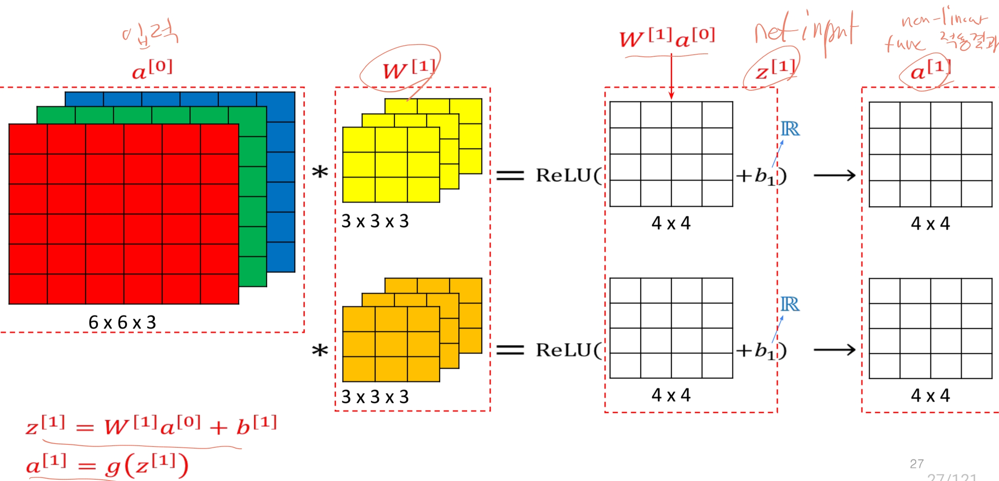

## CNN(Convolutional Neural Network)
이미지, 영상, 텍스트 등 고차원 데이터를 처리하기 위해 설계된 신경망 구조입니다.
CNN은 데이터를 지역적 패턴과 공간적 관계를 학습하는 데 특화되어 있으며, 특히 이미지 분류, 객체 탐지와 같은 시각적 데이터 분석에 뛰어난 성능을 발휘합니다.

기존의 신경망은 이미지와 같은 고차원 데이터를 처리할 때 많은 파라미터와 계산 비용이 필요해 학습과 추론 과정이 매우 비효율적이었습니다.
또한, 이미지의 지역적 패턴(예: 에지, 모서리, 질감 등)을 효과적으로 학습하기 어려웠습니다.
이를 개선하기 위해 등장한 것이 CNN입니다.

- 장점
    - 효율적인 파라미터 사용(파라미터 공유)
    - 공간적 관계 학습
    - 높은 정확도
    - 위치 불변성(이미지 위치가 조금 바뀌어도 특성 학습 잘 됨)
- 단점
    - 많은 연산 비용(고해상도 or 빅데이터)
    - 고정된 필터 크기(다양한 크기와 비율의 특징 모두 학습 한계)
- 파라미터
    - 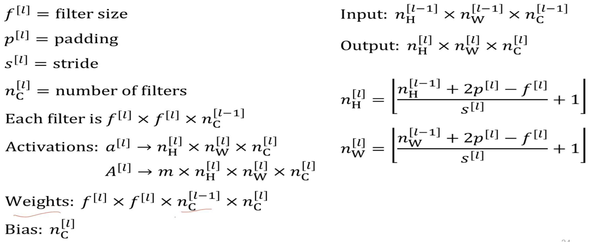

### ConvNet Example
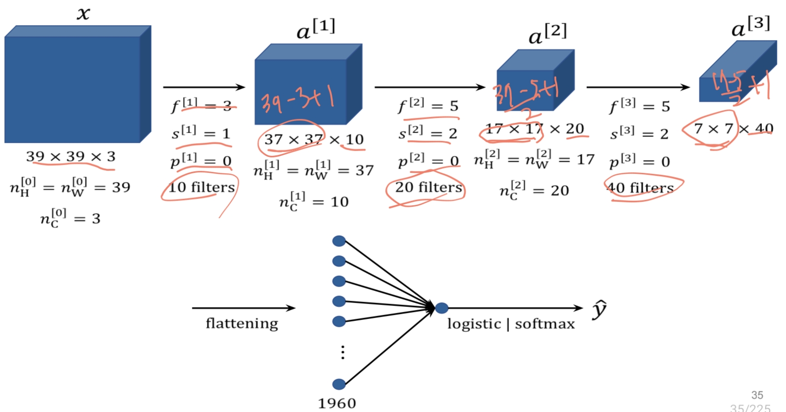

### Layer Type
1. Convolution Layer
2. Pooling Layer: 특징 맵(feature map)의 크기를 줄이고, 주요 특징만 남겨 계산량을 줄이며 모델의 복잡성을 낮추는 역할을 하는 연산입니다.
   - 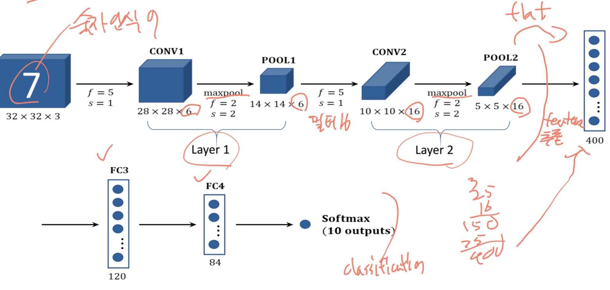
   - 종류
     - Max Pooling: 주어진 pooling window 내에서 가장 큰 값을 선택한다. 이미지의 가장 두드러진 특징을 잘 포착하는데 유리하다.
       - 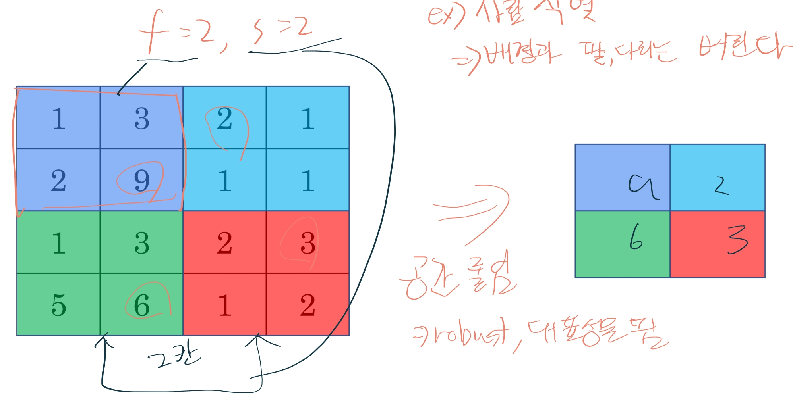 
     - Average Pooling: 주어진 pooling window 내에서 평균 값을 선택한다. 특성을 놓치는 건 없지만 노이즈 영향은 남아있음.
3. Fully Connected Layer : 모든 노드가 완전히 연결된 신경망 층을 의미합니다. FC Layer는 주로 분류(classification) 작업을 수행하는 최종 단계에서 사용되며, CNN이 학습한 모든 특징을 바탕으로 최종 예측을 수행합니다.

## CNN Model 비교
|-|-|-|-|-|
|**특성**|**AlexNet**|**GoogLeNet**|**VGGNet**|**ResNet**|
|**개념**|2012년 등장한 CNN의 성능을 입증한 모델. 깊고 큰 네트워크를 적용함.|네트워크의 깊이를 늘리는 대신 너비를 넓혀 다양한 크기의 필터로 특징을 학습하는 Inception 모듈을 사용합니다.|단순하고 깊은 구조를 통해 복잡한 특징을 학습합니다.|residual learning을 도입하여 깊은 신경망에서도 학습효율을 유지할 수 있도록 한 모델|
|**특징**|- 8개 레이어 - ReLU 활성화 함수 사용 - Max Pooling 사용|- 22개 레이어 - auxiliary losses -다양한 크기의 필터를 병렬로 사용 - global average pooling 사용|- 19개 레이어 - pre training - 3x3크기의 작을 필터를 다층으로 쌓은 구성|- 152 깊은 레이어 - 초깊은 신경망 -기울기소실 해결, 정확도 높음 |

### 1D Convolution
1D Convolution은 2D Convolution과 유사하게 입력 데이터에 대해 필터를 적용하여 특징을 추출하는 연산입니다. 1D Convolution은 주로 시계열 데이터와 같은 1차원 데이터에 대해 사용되며, 시간적인 특성을 학습하는 데 적합합니다.
긴 문자에 부적합하지만 병렬처리가 가능하다.

## RNN(Recurrent Neural Network)
RNN은 순환신경망으로, 시퀀스 데이터를 처리하기에 적합한 구조를 가진 인공신경망입니다. RNN은 일반적인 신경망과는 달리 순차적 데이터를 처리하고, 시간 의존성을 학습할 수 있는 특징이 있습니다. RNN은 이전 단계의 출력을 현재 단계의 입력으로 활용하며, 이를 통해 시계열 데이터를 효율적으로 다룰 수 있습니다.
- RNN의 핵심은 순환 구조에 있다. 각 timestep마다 입력을 받으며, 그 이전 단계에서 나온 출력을 현재 단계의 입력과 함께 처리한다.
- 장기의존성에서 구조적으로 능력이 제한되는데 기울기 소실(gradient vanishing) 때문이다.

- 장점
  - 길이의 한계를 극복했으며 input length에 따라 model size 변경 없음
  - 단계별 같은 weight 사용
  - 시간적 의존성을 모델링할 수 있음(이전 단계 정보 사용 가능)
- 단점
  - 기울기 소실 문제
  - 반복계산 느림
  - 병렬처리 어려움

### RNN Formula
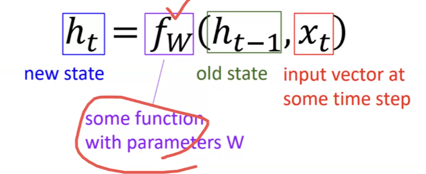
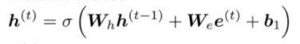

## Seq2Seq
- RNN(LSTM)을 2개 사용하여 Encoder와 Decoder로 구성한 모델
  - Encoder: input sequence를 고정 크기의 context vector로 인코딩
  - Decoder: context vector를 기반으로 output sequence를 생성
- input sequence 전체를 압축하여 전달하므로 전체적인 문맥 유지에 좋음
- 모듈화가 되어 encoder와 decoder를 각기 다른 설계 방식 적용 가능
- 복잡한 관계에서도 우수한 성능(영어 -> 한국어, 어순과 시퀀스 크기가 달라도 잘 됨)
  - 요약, 대화, 코드 생성 등
- 단점
  - encoder에서 input sequence를 끝에 단일 벡터로 압축하기 때문에 긴 sequence에서는 정보 손실 가능성(병목현상)
  - decoder에서 순차적으로 작동하기 때문에 병렬처리 어렵고 속도가 느림

## Attention
- Attention은 앞서 있었던 병목 현상을 해결함.
  - Decoder의 각 단계에서 Encoder에 대한 직접 연결을 하여 특정 부분에 집중하도록 함.(문맥에 따라 집중할 단어를 결정한다! <- 핵심 개념)
  - 직접 연결을 해서 기울기 소실 문제도 개선됨.
- 의미있는 성능 향상, 좀 더 사람 같은 결과
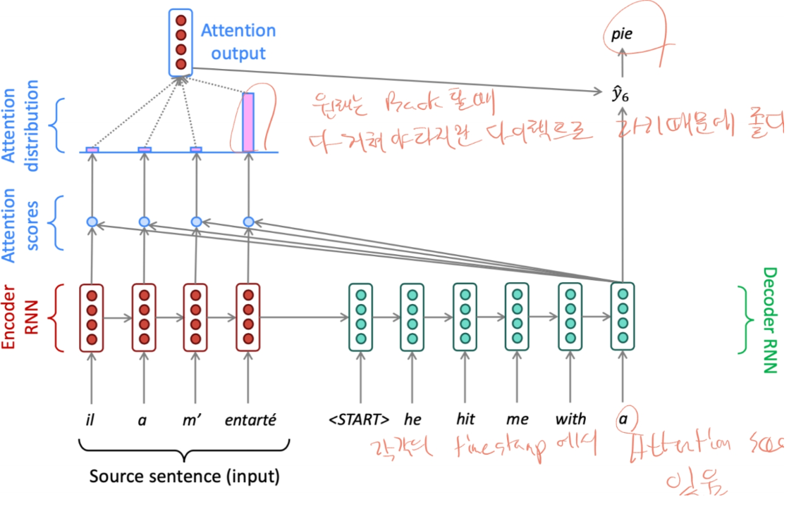
1. encoder hidden state(value), decoder hidden state(query), timestep t를 가진다.
2. decoder 벡터에서 encoder 벡터로 내적을 하여 attention score를 구한다.
3. attention score에 softmax를 적용하여 확률분포를 구한다. 이는 attention weights로 어느 입력 요소에 더 집중해야 할지를 나타낸다.
4. attention 가중치를 각 hidden state에 곱하고 마지막에 더해서 attention ouput을 구한다.
5. decoder hidden state와 attention output을 계산하여 다음 단어를 예측한다.

### Self-Attention
Self-Attention은 입력 데이터 시퀀스의 각 요소가 스스로 다른 요소들과 상호작용하면서 정보를 추출하는 방식이다. 즉, 시퀀스 내에서 각 위치의 단어가 다른 모든 위치의 단어들과의 관계를 계산하여, 그 상호작용에 따라 중요한 정보를 추출합니다. 이를 통해 멀리 떨어진 위치에 있는 단어들 간에도 상호작용을 쉽게 모델링할 수 있습니다.
병렬연산이 가능하며 긴 문자에 대해서도 효과적이지만 처리량에 따라 메모리가 많이 필요하다.

1. Query, Key, Value 벡터로 변환
   - Query: 정보를 찾고자 하는 질문
   - Key: 다른 요소들과의 유사도를 비교하는 키
   - Value: 최종적으로 반영되는 정보
2. 유사도 계산 각 Query Vector와 Key Vector를 내적하여 유사도를 계산한다.
3. Attention Weight 계산 유사도를 계산 후, softmax 함수로 변환하여 각 요소에 대한 가중치를 구합니다.
4. 가중합 계산 각 요소의 Value Vector에 계산된 가중치를 곱해 가중합을 구한다. 이게 Self-Attention의 결과이다.

#### Self-Attention Limit
|-|-|
|**허들**|**해결방안**|
|순서에 대한 정보가 없다.|position embedding 추가|
|NN에서 layer 사이사이에 nonlinear func을 넣어줘야하는데 없다|모듈의 추가(feed-forward network 같은...)|
|단어 생성 시 미래정보를 알고있으면 안됨|미래에 대한 정보는 마스킹|

## Transformer
자연어 처리에서 사용되는 혁신적인 모델이며 아래와 같은 특징이 있다.

- 병렬처리가 가능해 모든 단어를 동시에 처리할 수 있어 학습 속도와 성능이 크게 향상되었다.
- Self-Attention을 사용하여 각 단어가 다른 단어와 연관 관계를 학습하여 멀리 떨어진 단어와의 상호작용도 가능하다.
- Positional Encoding을 사용해서 입력 시퀀스의 순서 정보를 유지한다.

Decoder의 아키텍처를 보면 Self-Attention과 유사하다. 다만 특이하게 Add & Norm이 들어가 있는데 최적화 기법 중 하나이고 잔류 연결 및 계층 정규화를 통해 비슷한 의미를 가지도록 한다.

## Attention / Transformer for Vision

### 다양한 접근법
1. CNN에 attention 추가
   - CNN 아키텍처 중간에 Self-Attention을 추가
2. Convolution을 Local Attention으로 바꾸자.
   - 픽셀 단위로 기준 픽셀은 query 나머지 픽셀은 key value 적용
   - 결론은 CNN은 없앨 수는 있는데 성능이 드라마틱하게 좋아지진 않았다.
3. 이미지 픽셀을 단위로 해서 sequence로 쭉 나열해서 트랜스포머에 넣어보자.
   - 메모리가 많이 먹었다.
4. 이미지를 patch를 단위로 해서 sequence 토큰으로 만들어 선형변환, positional encoding을 추가해서 트랜스포머에 넣어보자.
   - classification token을 넣어서 마지막 input으로 추가
   - ViT(Vision Transformer)이라고 한다.

### ViT vs Resnets
- 데이터가 많을 경우 ViT가 성능이 더 좋으나 적을 경우 CNN(ResNet)이 더 낫다.
- ViT는 "less inductive bias"라고 표현하며 CNN은 주변부만 보지만 Transformer는 글로벌하게 보기 때문에 유도적 편향이 덜하다. 
- ViT의 개선방향
  - Augmentation, Regularization을 적용
  - Distillation을 통해 CNN 학습 후 트랜스포머로 활용
  - Swin Transformer : CNN의 계층구조에 영감을 얻어 ViT에 계층구조 적용
    - 이미지를 작은 패치로 나누어 계층을 쌓아가는 방식
    - 계속 나누다보니 메모리 문제 발생
    - Local Window 개념을 적용해서 이미지 블록을 작은 윈도우로 나누어 로컬 영역 내에서만 셀프 어텐션을 적용한다.
    - 이로 인해 연산량이 크게 줄어들고, 각 윈도우 간의 정보를 주기적으로 교환하는 방식으로 전역 정보를 결합해간다.
    - 윈도우가 겹치는 부분에 대한 정보가 부족하기에 Shifted Window라는 방법을 사용한다.(윈도우 이동시킴)