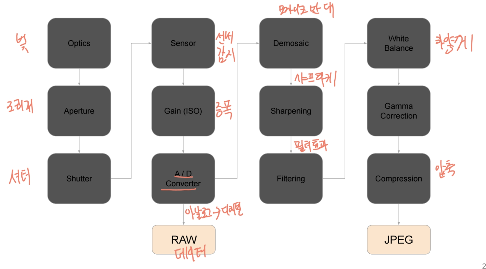
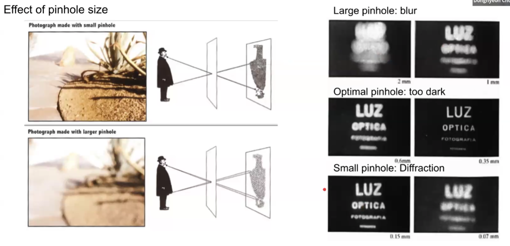
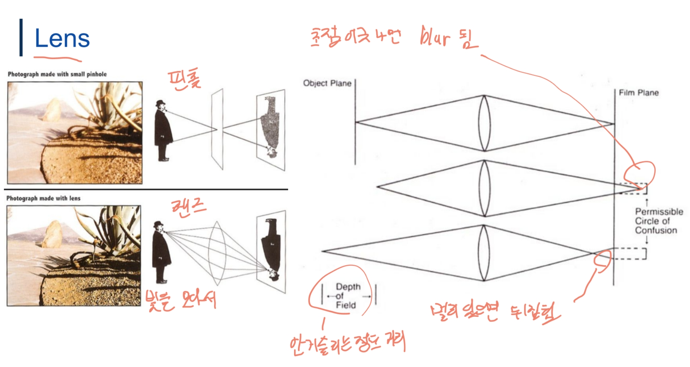
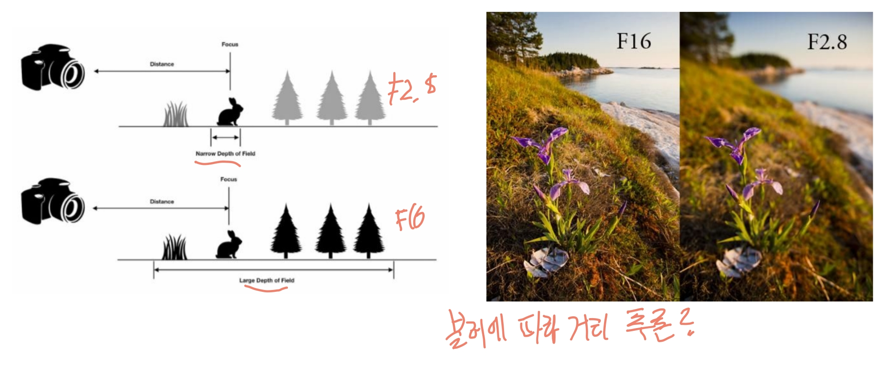
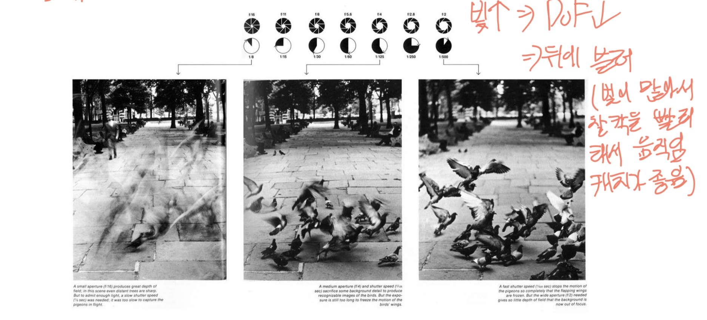
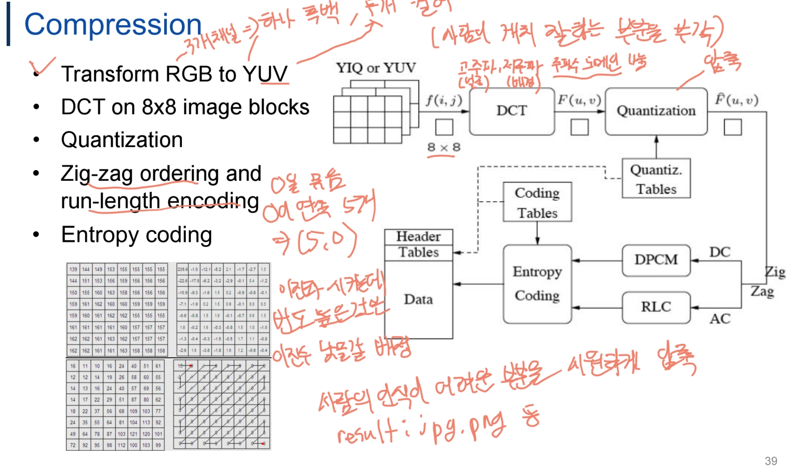
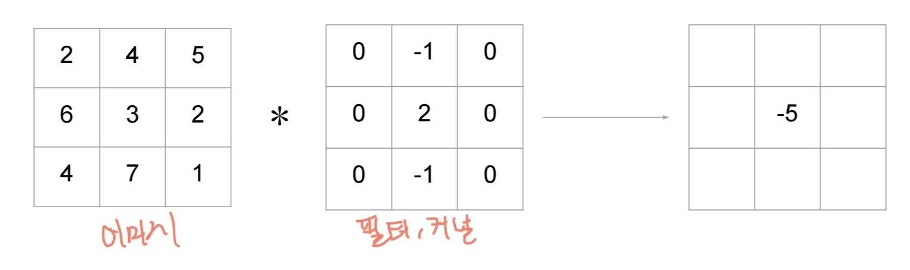
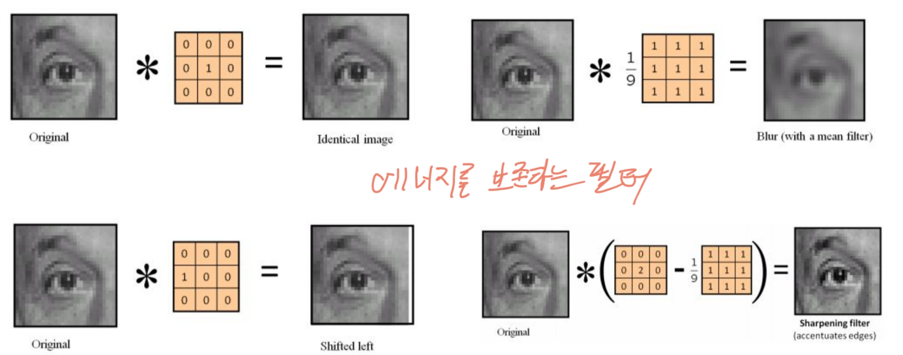
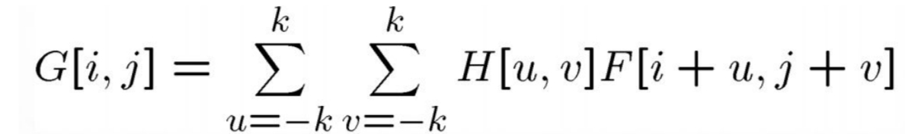
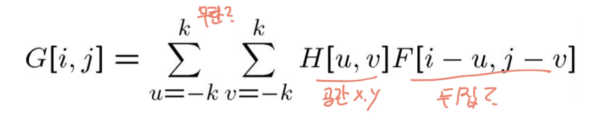

# Image Model

## Understanding Image Data
### Digital Camera & Digital Image
- Digital Camera : 빛을 이산화 신호로 변환하는 장비이며 조리개, 렌즈 및 CCD 센서를 포함한다.
- Digital Image : 연속적인 이미지 f(x,y)를 나타내는 이산화 샘플 f[x,y]를 말함. 각 요소들은 픽셀이라 불림

### Image Sensing Pipeline

### Pinhole Camera & Lens
- Pinhole

- Lens

### 렌즈사용 시 효과(아날로그)
#### Depth of Field(DoF - 심도)
흐림이 허용되는 이미지 평면 간의 거리를 말한다. 특정 영역에 집중하고 뒷 부분 블러처리 가능.

#### Aperture(조리개) & Shutter Speed
빛이 많아지면 Dof가 내려가고 뒤에 블러처리가 된다. 그래서 빛이 많아서 찰칵을 빨리하고 움직임 캐치가 좋음

#### Field of View(FoV)
카메라로 본 3D 공간의 일부의 각도 측정

#### Vignetting
가장자리가 어두워지는 효과

#### ISO (Gain)
- 카메라에 있는 이미지 센서의 빛에 대한 민감도
- 낮으면 좀 선명하고 ISO 100은 효과 X, ISO 1600은 16배 증폭을 나타냄

### 디지털화
#### Sampling & Quantization
- 샘플링은 공간의 이산화를 나타냄
- 양자화는 강도 값의 이산화에 해당한다.

#### Demosaic
디지털 카메라의 이미지 센서에서 촬영된 베이어 패턴 데이터를 풀컬러 이미지로 변환하는 과정
- 일반적으로 베이어 필터 배열을 사용하여 R, G, B 색상을 감지하고 G 채널이 2배로 더 많다.(인간은 녹색에 가장 민감)
- 원본 센서 데이터는 불완전한 컬러 정보를 포함하고 있으며, 이를 복원하여 풀컬러 이미지를 생성해야함.

#### White Balance
사람이 보는거랑 카메라가 보는게 다름. 흰색이 사람이 보는 흰색이면 좋겠다는 의도로 적용하며 카메라별로 파라미터가 다름

#### Gamma Correction
이미지 또는 영상의 밝기를 보정하는 비선형 변환 기법
- 감마 1 원본 기준으로 1 이하면 밝아지고 이상이면 어두워짐

#### Compression
디지털 이미지 또는 영상을 저장하거나 전송 시 압축하는 과정이며 예시로 JPEG의 압축과정은 아래와 같다.
1) RGB -> YUV 변환(Y 휘도, UV 색상)
   - 사람의 눈은 색 정보보다 밝기 정보(Y)에 더 민감하기에 분리
2) 다운샘플링
   - Y데이터는 유지, U, V는 낮춤
3) DCT 변환
   - 이미지를 8x8 블록 단위로 분할하고 이산 코사인 변환(DCT) 수행
   - 저주파 성분(이미지의 주요 정보)은 유지, 고주파 성분(세부 디테일)은 제거 가능
4) 양자화
   - 사람이 구별하기 어려운 고주파 성분을 삭제하여 데이터 크기를 줄임
   - 양자화 테이블을 사용하여 작은 값들은 0으로 만듦
5) Zig-zag ordering
6) Run-length encoding & Entropy coding
   - Run-length는 0을 묶는다. 0이 5개라면 (5,0)
   - Entropy coding은 데이터의 평균적인 비트 수를 줄이는 무손실 압축 기법
   - 방법 중 하나로 허프만 코딩

#### Color
빛의 바장에 따라 인간의 눈이 인식하는 시각적 감각
- 가산 혼합
  - 빛을 더하면 색상이 밝아짐(전부 합치면 흰색)
  - RGB 구성
- 감산 혼합
  - 색을 더하면 빛이 흡수되어 어두워짐(전부 합치면 검정)
  - CMY 구성
- Trichromatic Theory(삼색 이론)
  - 인간의 눈에는 세 종류의 원추세포가 있으며, 각각 특정 파장대의 빛 감지
    - S: 파란, M: 초록, L: 빨간

## Image Filtering
이미지 픽셀 값을 변형하여 특정한 효과를 주거나, 중요한 특징을 강조하는 과정이다.
필터링을 통해 노이즈 제거(denoise), edge 강조, feature 추출, 초해상도, 보간 등의 작업 수행이 가능하다.

### 목적
1) Low Level Vision
   - 이미지 데이터를 전처리 및 향상하기 위한 목적
   - 노이즈 제거, 샤프닝, 대비 향상 등에 사용됨
2) High Level Vision
   - 이미지에서 특징을 추출하여 분석 및 객체 인식 등에 활용
   - edge 검출, feature 추출, corner 검출 등에 사용

### Linear Filtering
- 선형 필터링은 이미지의 각 픽셀을 주변 픽셀들과 특정 가중치를 적용하여 새로운 값으로 변환하는 과정이다.
- 이 과정은 주로 Convolution 연산을 사용하여 수행됨.

#### Linear Filter Properties

- 선형성
  - 덧셈법칙: A*(B1 + B2) = (A*B1) + (A*B2)
  - 스케일링 법칙: A*(B1*B2) = B1*(A*B2)
- 변환 불변성(shift-invariant)
  - 입력 이미지가 특정 위치로 이동해도 출력이 동일한 방식으로 이동함.

#### Correlation Filter
상관 필터는 이미지 필터링에서 특정 패턴을 이미지에서 찾는 연산이며 이미지와 커널을 비교하여 유사한 부분을 찾는다.
- 필터를 그대로 사용하여 연산
- 입력 이미지 F(x, y)와 필터 H(u, v)를 그대로 곱하고 더하는 연산(가장 잘 일치 시에 최대)

#### Convolution Filter
필터를 180도 뒤집어서 연산하며 상관 연산과의 차이점은 커널을 뒤집느냐 안 뒤집느냐 차이임. 엣지 검출에 주로 사용

#### Gaussian Filter
가우시안 적용하여 평균과 분산을 사용. 블러처리를 하며 다루기가 쉬움. 퍼지면 블러, 모으면 원본

#### Edge Filter
엣지 외에는 날린다.(저주파는 날리고, 고주파는 살린다 -> 0을 전부 삭제해버림)
- Prewitt

- Roberts

- Laplacian operator: 2번의 미분을 통해 edge 감지, 노이즈에 취약함

- Laplacian of Gaussain: Laplacian을 보완하기 위한 기법
- Canny edge detector: 에지 검출 알고리즘이며 opencv의 기본적인 필터
  1) 가우시안 블러(Gaussian Blur) 적용
     - 노이즈를 줄이기 위해 가우시안 필터로 스무딩 처리
  2) Sobel Filter로 gradient 계산
     - 이미지의 밝기 변화를 계산하기 위해 소벨 필터를 사용한다.
  3) Non-Maximum Suppression(비최대 억제)
     - edge 두께를 얇게 하기 위해, gradient 방향에 따라 국소 최대값만 남기고 제거
  4) 이중 임곗값(Double Thresholding) 적용
     - edge 가도를 기반으로 강한 에지와 약한 에지 구분
  5) Edge Tracking by Hysteresis
     - 임곗값에서 구분된 약한 에지를 확인하고 강한 에지와 연결된 경우 에지로 인정. 나머지는 제거

## Image Geometry
### Perspective Pinhole Camera(투영 카메라 모델)
- 일반적인 카메라는 바늘구멍(pinhole) 카메라 모델을 기반으로 이미지를 투영함.
- 광선이 광학 중심을 지나면서 이미지 평면에 투영됨.
- z-축(광축, Optical Axis) 이 이미지 평면과 수직을 이루며 광학 중심을 통과함.
- 3D가 2D로 압축됨

### Mathematical Model for Pinhole Camera(카메라의 수학적 모델)
카메라는 3D 세계 좌표 (𝑋 , 𝑌 , 𝑍)를 2D 이미지 평면 상의 좌표 (𝑥 , 𝑦)로 변환하는 역할을 합니다. 
핀홀 카메라 모델을 사용하면 다음과 같은 수식으로 나타낼 수 있습니다.

이 방정식의 의미는 다음과 같습니다
- 𝑓(초점 거리)만큼 Z축을 따라 떨어진 이미지 평면에 점이 투영됨.
- 3D 공간에서 Z축 방향으로 멀어질수록 (즉, 𝑍 값이 커질수록) 이미지 좌표에서의 크기가 작아짐 (원근법 효과).

위의 투영 방정식은 비선형적인 형태를 가지고 있습니다. 하지만 동차 좌표(homogeneous coordinates) 를 사용하면 행렬 연산으로 쉽게 변환할 수 있습니다.
동차 좌표를 사용하면 3D 좌표 (𝑋 , 𝑌 , 𝑍)를 4차원 벡터로 확장할 수 있습니다.

## Image Feature

