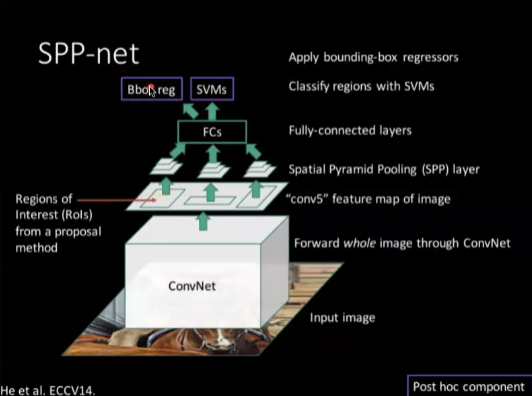
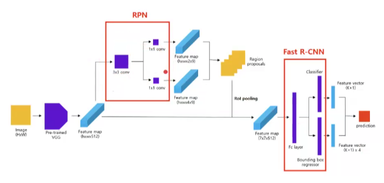
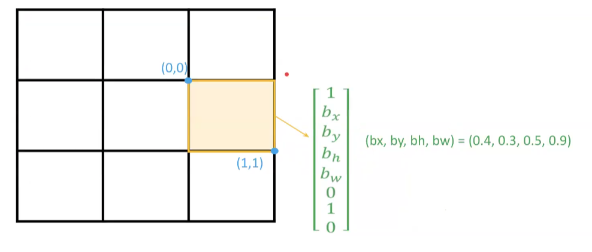
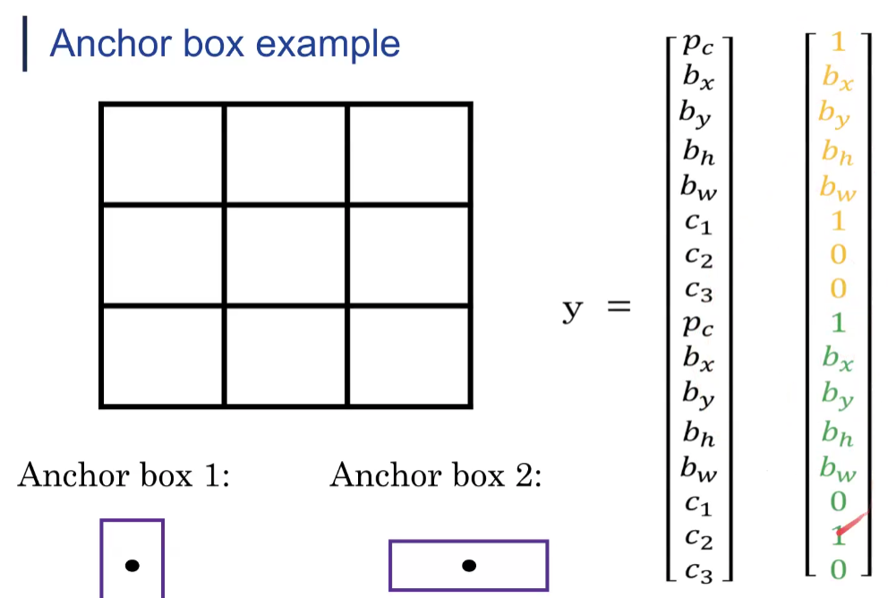
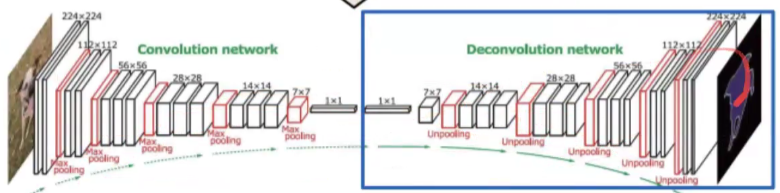
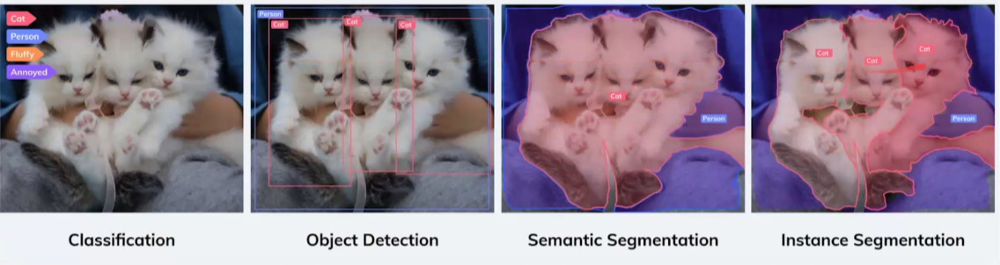

# Object Detection and Segmentation

## RCNN(Regions with CNN features)
이미지에서 객체가 있을 법한 후보 영역을 먼저 추출하고, 각각의 후보 영역에 대해 CNN을 적용하여 객체의 존재 여부와 종류를 분류하는 2단계 방식의 객체 탐지 모델입니다.
### 장단점
- 장점
  - CNN을 localize and segment에 적용한 사례
  - label이 별로 없음에도 학습
- 단점
    - 속도가 느림
    - 후보 영역을 추출하는 알고리즘이 느림
    - 학습과정이 복잡함(CNN SVN Bounding box Regression 등)

### 프로세스
1. CNN image classification task를 pre-training함
2. Region Proposal (영역 후보 생성)
   - Selective Search 알고리즘을 사용해 이미지에서 객체가 있을 법한 후보 영역 2000개를 생성합니다
3. Feature Extraction (특징 추출)
   - 각 후보 영역을 CNN에 통과시켜 고차원 feature vector를 추출합니다.
4. Classification & Bounding Box Regression
   - SVM(Support Vector Machine)으로 객체 분류
   - Bounding Box Regressor로 위치 보정
5. 최종 출력
   - 여러 후보 중 겹치는 영역을 제거하고 가장 높은 점수를 가진 객체를 선택합니다.
   - 객체의 클래스와 위치(Bounding Box 좌표)

## SPPnet(Spatial Pyramid Pooling Network)
객체 탐지 성능 개선과 속도 향상을 목표로 RCNN을 개선한 모델이다. 전체 이미지에 CNN을 한 번만 적용하고,
다양한 크기의 후부 영역에 대해 feature map 상에서 pooling을 통해 고정된 크기의 feature를 추출한다.

### 프로세스
1. 전체 이미지에 CNN을 적용하여 feature map을 추출합니다.
2. Region Proposal을 통해 후보 영역을 추출합니다.(Selective Search)
3. SPP Layer 적용
   - 각 영역을 feature map 위에서 crop
   - SPP Layer를 통해 고정된 크기의 feature vector 변환
   - Pooling 적용
4. Fully Connected layer
5. SVM
6. Bounding Box Regression

- 여전히 end-to-end가 아님
- fine-tuning 때 Conv Layer는 훈련 불가

## Fast RCNN
속도와 정확도, 학습 효율성을 개선한 모델이며 SPP를 ROI Pooling으로 대체했다.

### 프로세스
1. CNN image classification task를 pre-training함
2. Region Proposal을 통해 후보 영역을 추출합니다.(Selective Search)
3. feature 추출합니다.
4. ROI Pooling Layer 적용
   - Max Pooling 적용
   - 고정된 크기의 feature vector 변환 
5. Fully Connected layer
6. 출력
   - Softmax를 통해 객체의 클래스를 분류
   - Bounding Box Regression을 통해 객체의 위치를 보정

- end-to-end 학습 가능
- 속도가 더 빠르고 multi-task loss 적용
- 여전히 Selective Search에 의존성을 가짐

## Faster RCNN
Region Proposal Network(RPN)을 통해 후보 영역을 추출하는 방식으로 속도를 개선한 모델이다.

### 프로세스
1. CNN image classification task를 pre-training함
2. RPN을 통해 후보 영역을 추출합니다.
3. RoI Pooling Layer 적용(각 후보 영역에 대해 고정 feature 추출)
4. Classification & Bounding Box Regression

- RPN(GPU)으로 Selective Search(CPU)이 대체되어 빨라짐

## 주요 변화 흐름
|-|-|-|-|-|
|**모델명**|**Region Proposal**|**CNN**|**속도**|**특징**|
|**RCNN**|Selective Search|후보영역마다 CNN|느림|분류는 SVM, bbox는 따로|
|**SPPnet**|Selective Search|전체 CNN + SPP|빠름|FC입력 크기 고정|
|**Fast RCNN**|Selective Search|전체 CNN + ROI Pooling|빠름|end-to-end 학습 가능|
|**Faster RCNN**|RPN|전체 CNN + ROI Pooling|매우 빠름|proposal도 학습|

## YOLO(You Only Look Once)
객체 탐지를 위해 이미지를 단 한 번만 CNN에 통과시켜(1-stage), 객체의 클래스와 위치를 동시에 예측하는 실시간 객체 탐지 모델이다.

### 프로세스
1. 이미지를 N x N 그리드로 분할(예: 7 x 7)
2. 각 그리드 셀에서 예측
   - A개의 bounding box와 그에 대한 confidence score 예측
   - 각 bounding box는 (x, y, w, h, confidence)를 가짐
   - 
3. 출력 shape, Non-Maximum Suppression으로 중복 박스 제거

### Overlapping 이슈가 있어 Anchor 개념 도입함

- Darknet이라는 아키텍처를 씀
- Fast RCNN에 비해 정확도가 높은 것까진 아니고 배경 감지를 잘함
- 분할된 박스에 안들어가면 감지하기 쉽지 않다.

## SSD(Single Shot MultiBox Detector)
YOLO와 유사하게 단일 네트워크로 객체 탐지를 수행하는 모델이다. 다양한 크기의 feature map을 활용하여 객체의 위치와 클래스를 예측한다.

- 이전 모델에 비해 빨라지고 정확도가 높아짐
- 다만 Faster RCNN보다는 작은 객체에 감지력이 딸린다.

## YOLO 개선을 위해...
- Bach Normalization
- High Resolution Classifier
- Anchor boxes
- Fine-grained features
- Multi Scale Training

## DETR
Transformer 기반 객체 탐지 모델입니다.

### 작동방식
1. CNN backbone을 통해 이미지의 feature map을 추출합니다.
2. Transformer Encoder-Decoder 구조를 통해 객체의 위치와 클래스를 예측합니다.

## Segmentation
- 객체 탐지(Object Detection)는 객체의 위치와 클래스를 예측하는 작업
- 최초에는 픽셀단위로 했지만 비효율
- Fully Convolutional Network(FCN)이 등장하면서 효율적인 방법이 등장, pooling도 효율성을 위해 사용

### DconvNet
- Max Pooling을 하고 Upsampling을 통해 복원하는데 Unpooling을 해서 max pooling의 결과와 위치 정보를 가지고 나머지 공간은 learnable한 filter로 채워줌

### Instance Segmentation

#### Mask R-CNN
- Faster R-CNN + Mask branch

### Panoptic Segmentation
- Semantic Segmentation + Instance Segmentation
- 배경과 객체 다 식별